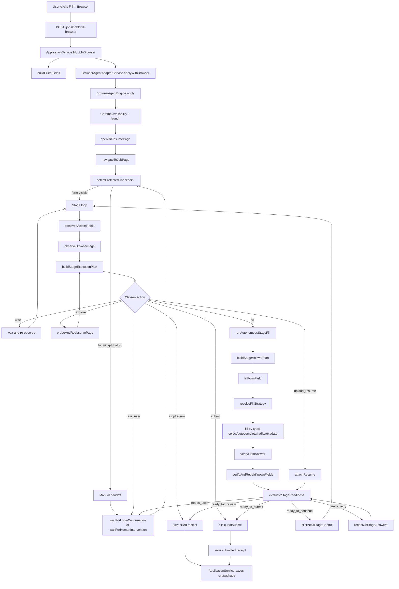
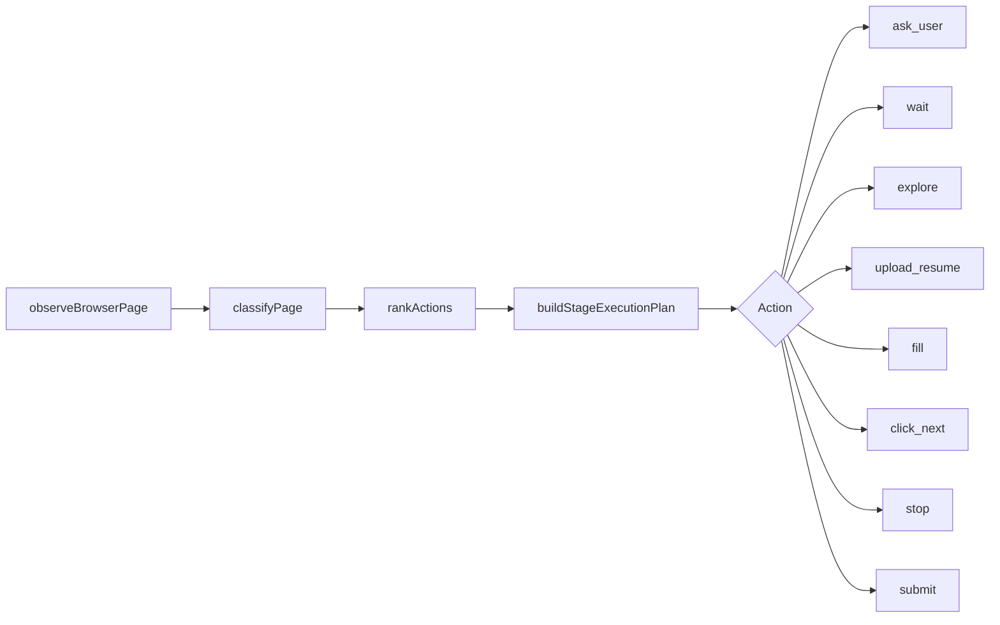
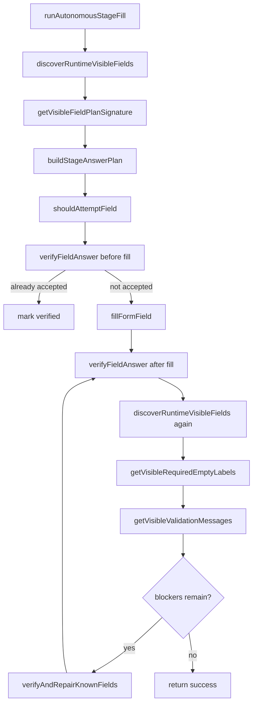
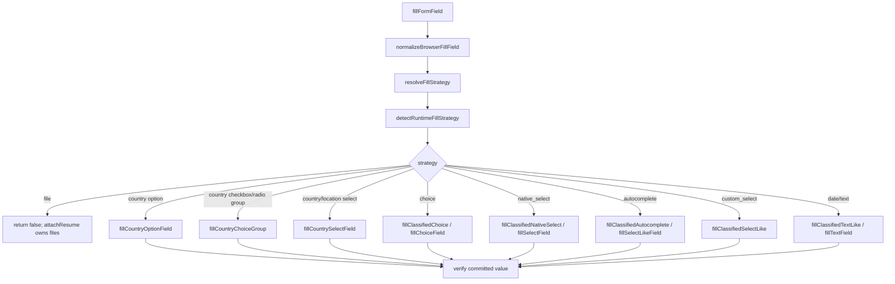

# GradLaunch Browser Agent Code Flow

This document explains the current browser-agent architecture from the moment a user starts filling a pasted job URL until the browser run is saved. It is written as a code map: every major step names the exact function that owns that responsibility.

## One-Line Summary

GradLaunch receives a job URL, creates or reuses an application record, prepares profile/resume answers, opens the real job portal in a controlled Chrome profile, pauses for login/CAPTCHA when needed, scans the visible form, chooses the safest action, fills fields with DOM-specific strategies, verifies/repairs the current page, then either moves forward, pauses for review, or submits if explicitly allowed.

## Current Architecture Diagram



## Active Folder Map

```text
gradlaunch/
  apps/api/src/routes/
    application-routes.ts
      API endpoint that starts or resumes browser filling.

  apps/api/src/services/
    application-service.ts
      Loads student/job/resume/memory, creates the ApplicationRun, and saves the final receipt.

    browser-agent-adapter-service.ts
      Adapter facade for GradLaunch's built-in browser agent.

    browser-agent/
      engine.ts
        Top-level orchestration: Chrome launch, login handoff, stage loop, upload, fill, verification, navigation, final receipt.

      observe.ts
        Browser "eyes": visible fields, controls, page state, validation, required fields, submit/next controls.

      strategy.ts
        Decision layer: classify page state, rank next actions, classify recovery path.

      plan.ts
        Converts classification/action scores into one StageExecutionPlan.

      answer.ts
        Determines what value belongs in each visible field using profile, resume, memory, deterministic rules, and optional LLM.

      fill.ts
        Low-level DOM interaction layer: detect real control type and fill with the correct strategy.

      autonomous-fill.ts
        Page-level fill -> verify -> repair loop.

      eval.ts
        Decides whether the current page is ready to continue, needs retry, needs user help, review, or submit.

      reflect.ts
        Optional LLM repair pass when validation blockers remain.

      ui.ts
        Injects/updates the live bot and consumes Stop/Continue clicks from the user.

      planner.ts
        Durable run trace: observations, decisions, outcomes, handoffs, retries.

      session.ts
        Persists browser execution session state for resume/manual handoff.

      types.ts
        Shared browser-agent types.

      util.ts
        Normalization, debug logging, filesystem helpers.
```

## End-To-End Function Chain

```text
registerApplicationRoutes()
  -> ApplicationService.fillJobInBrowser()
     -> buildFilledFields()
     -> BrowserAgentAdapterService.applyWithBrowser()
        -> BrowserAgentEngine.apply()
```

Exact links:

| Step | Function | Responsibility |
| --- | --- | --- |
| API route registration | [`registerApplicationRoutes()`](../apps/api/src/routes/application-routes.ts#L8) | Registers application endpoints, including browser fill. |
| Browser fill endpoint | [`POST /jobs/:jobId/fill-browser`](../apps/api/src/routes/application-routes.ts#L78) | Reads authenticated student id, job id, submit flag, then calls application service. |
| Application orchestration | [`ApplicationService.fillJobInBrowser()`](../apps/api/src/services/application-service.ts#L154) | Loads student/job/resume/memory, prepares run state, calls browser adapter, saves final application/run. |
| Prepared answer fields | [`buildFilledFields()`](../apps/api/src/services/application-service.ts#L791) | Builds known profile/resume/job facts used as base form answers. |
| Browser adapter facade | [`BrowserAgentAdapterService.applyWithBrowser()`](../apps/api/src/services/browser-agent-adapter-service.ts) | Passes the compact browser context into `BrowserAgentEngine.apply()`. |
| Main browser engine | [`BrowserAgentEngine.apply()`](../apps/api/src/services/browser-agent/engine.ts#L167) | Owns the complete browser execution lifecycle. |

## BrowserAgentEngine Lifecycle

### 1. Availability And Runtime

Relevant functions:

| Function | Link | What it does |
| --- | --- | --- |
| `BrowserAgentEngine.getAvailability()` | [`engine.ts#L69`](../apps/api/src/services/browser-agent/engine.ts#L69) | Checks whether GradLaunch can use logged CDP, logged profile, managed CDP, managed profile, or Chrome executable. |
| `launchContext()` | [`engine.ts#L2926`](../apps/api/src/services/browser-agent/engine.ts#L2926) | Opens or attaches to Chrome using the configured profile strategy. |
| `createPlannerCheckpoint()` | [`planner.ts#L19`](../apps/api/src/services/browser-agent/planner.ts#L19) | Creates the durable trace for the run. |
| `writeBrowserDebug()` | [`util.ts#L88`](../apps/api/src/services/browser-agent/util.ts#L88) | Writes debug events only when debug logging is explicitly enabled. |

What happens:

1. The engine validates the job URL.
2. It keeps runtime files in OS temp only when debug/screenshots are explicitly enabled.
3. It creates or resumes a planner checkpoint.
4. It launches/attaches Chrome using the safest available profile mode.
5. It installs browser safety handlers so dialogs/crashes are recorded.

### 2. Open Or Resume The Job Page

Relevant functions:

| Function | Link | What it does |
| --- | --- | --- |
| `openOrResumePage()` | [`engine.ts#L1869`](../apps/api/src/services/browser-agent/engine.ts#L1869) | Reuses an existing application tab when possible, otherwise creates a new tab. |
| `navigateToJobPage()` | [`engine.ts#L1884`](../apps/api/src/services/browser-agent/engine.ts#L1884) | Navigates using `goto`, `window.location`, and address-bar fallback for blank-tab failures. |
| `getActivePage()` | [`observe.ts#L22`](../apps/api/src/services/browser-agent/observe.ts#L22) | Picks the meaningful active page after redirects/new tabs. |
| `clickSoftGate()` | [`observe.ts#L61`](../apps/api/src/services/browser-agent/observe.ts#L61) | Clears harmless cookie/continue overlays. |

Why this exists:

Job portals often redirect, open blank tabs, or spawn login tabs. The engine avoids acting on `chrome://new-tab-page/` or stale pages by repeatedly selecting the active meaningful page.

### 3. Login, CAPTCHA, OTP, Verification Handoff

Relevant functions:

| Function | Link | What it does |
| --- | --- | --- |
| `detectProtectedCheckpoint()` | [`observe.ts#L820`](../apps/api/src/services/browser-agent/observe.ts#L820) | Detects login, CAPTCHA, OTP, and human verification screens. |
| `waitForLoginConfirmation()` | [`engine.ts#L3167`](../apps/api/src/services/browser-agent/engine.ts#L3167) | Hard-pauses filling until the user logs in and clicks the live bot continue button. |
| `waitForHumanIntervention()` | [`engine.ts#L3547`](../apps/api/src/services/browser-agent/engine.ts#L3547) | Waits for manual CAPTCHA/OTP/missing-data work. |
| `updateLiveBot()` | [`ui.ts#L68`](../apps/api/src/services/browser-agent/ui.ts#L68) | Shows the in-browser status panel and buttons. |
| `consumeUserContinueConfirmation()` | [`ui.ts#L555`](../apps/api/src/services/browser-agent/ui.ts#L555) | Reads the user's "continue" click. |

Important behavior:

```text
Login detected
  -> Stop all autonomous filling
  -> Show live bot handoff
  -> User logs in manually in the same controlled Chrome window
  -> User clicks "I am logged in, continue"
  -> Engine verifies the protected checkpoint cleared
  -> Only then the stage loop resumes
```

This is intentionally strict. The bot should not keep observing-then-filling while the user is typing login credentials, because that is how context gets lost and fields get overwritten.

### 4. Stage Loop

The main loop lives inside [`BrowserAgentEngine.apply()`](../apps/api/src/services/browser-agent/engine.ts#L167). Each iteration treats the current visible screen as one stage.

```text
for each stage:
  get active page
  check Stop button
  save screenshot
  clear soft gates
  detect protected checkpoint
  discover fields
  observe page
  classify and plan
  execute one safe action
  verify page
  click next or pause
```

Relevant functions:

| Function | Link | What it does |
| --- | --- | --- |
| `plannerEnterStage()` | [`planner.ts#L91`](../apps/api/src/services/browser-agent/planner.ts#L91) | Records that the engine entered a new stage. |
| `discoverVisibleFields()` | [`observe.ts#L116`](../apps/api/src/services/browser-agent/observe.ts#L116) | Finds visible form controls across frames/shadow roots and assigns GradLaunch ids. |
| `observeBrowserPage()` | [`observe.ts#L590`](../apps/api/src/services/browser-agent/observe.ts#L590) | Builds the page snapshot: text, fields, controls, validation, grouped fields, ATS hint, page state. |
| `getStageSignature()` | [`observe.ts#L787`](../apps/api/src/services/browser-agent/observe.ts#L787) | Creates a signature used for resume and loop detection. |
| `getPageFingerprint()` | [`observe.ts#L712`](../apps/api/src/services/browser-agent/observe.ts#L712) | Detects same-screen loops. |
| `recordPlannerObservation()` | [`planner.ts#L122`](../apps/api/src/services/browser-agent/planner.ts#L122) | Saves visible and required field labels into the planner trace. |

### 5. Page Classification And Action Planning



Relevant functions:

| Function | Link | What it does |
| --- | --- | --- |
| `classifyPage()` | [`strategy.ts#L42`](../apps/api/src/services/browser-agent/strategy.ts#L42) | Scores page state: login, captcha, loading, resume upload, validation error, form fill, review, submit, start, empty, unknown. |
| `rankActions()` | [`strategy.ts#L162`](../apps/api/src/services/browser-agent/strategy.ts#L162) | Ranks safe next actions based on classification and visible evidence. |
| `buildStageExecutionPlan()` | [`plan.ts#L15`](../apps/api/src/services/browser-agent/plan.ts#L15) | Chooses one action with reason/checklist for the engine. |
| `probeAndReobservePage()` | [`strategy.ts#L342`](../apps/api/src/services/browser-agent/strategy.ts#L342) | Performs safe exploration when confidence is low. |
| `classifyRecovery()` | [`strategy.ts#L260`](../apps/api/src/services/browser-agent/strategy.ts#L260) | Classifies blockers like missing required, upload pending, network delay, unknown validation. |

Safety rule:

The engine does not jump directly from "unknown page" to "click random button." Unknown/uncertain pages route to safe exploration or user handoff.

### 6. Resume Upload

Resume upload is attempted before normal field filling because many portals parse the resume and then reveal more form fields.

Relevant functions:

| Function | Link | What it does |
| --- | --- | --- |
| `hasFileUpload()` | [`observe.ts#L1932`](../apps/api/src/services/browser-agent/observe.ts#L1932) | Detects visible resume/file upload opportunities. |
| `attachResume()` | [`fill.ts#L2679`](../apps/api/src/services/browser-agent/fill.ts#L2679) | Main resume upload entry point. |
| `attachResumeToBestFileInput()` | [`fill.ts#L2798`](../apps/api/src/services/browser-agent/fill.ts#L2798) | Uploads directly to the best file input if present. |
| `attachResumeViaUploadTrigger()` | [`fill.ts#L3074`](../apps/api/src/services/browser-agent/fill.ts#L3074) | Clicks a safe upload trigger and handles file chooser/associated input. |
| `attachResumeToAssociatedInput()` | [`fill.ts#L3653`](../apps/api/src/services/browser-agent/fill.ts#L3653) | Uploads to a hidden file input associated with the visible trigger. |
| `waitForResumeUploadCompletion()` | [`engine.ts#L2208`](../apps/api/src/services/browser-agent/engine.ts#L2208) | Waits for resume upload processing or stage transition without waiting forever. |

Upload flow:

```text
hasFileUpload()
  -> attachResume()
     -> direct file input
     -> associated hidden input
     -> upload trigger + file chooser
  -> waitForResumeUploadCompletion()
  -> re-observe next stage
```

### 7. Answer Planning

The answer planner decides what should be filled. It does not decide how to interact with the DOM.

Relevant functions:

| Function | Link | What it does |
| --- | --- | --- |
| `buildStageAnswerPlan()` | [`answer.ts#L34`](../apps/api/src/services/browser-agent/answer.ts#L34) | Produces answer candidates for the current visible fields. |
| `createDeterministicAnswerMap()` | [`answer.ts#L149`](../apps/api/src/services/browser-agent/answer.ts#L149) | Uses prepared fields, memory, student profile, job, and resume text before LLM. |
| `resolveDeterministicFieldValue()` | [`answer.ts#L192`](../apps/api/src/services/browser-agent/answer.ts#L192) | Resolves one visible field to a trusted deterministic value. |
| `resolveLocationFieldValue()` | [`answer.ts#L509`](../apps/api/src/services/browser-agent/answer.ts#L509) | Handles city/location/country values. |
| `normalizeChoiceAnswers()` | [`answer.ts#L561`](../apps/api/src/services/browser-agent/answer.ts#L561) | Normalizes radio/checkbox/select answers, especially country groups. |
| `askLlmForStageAnswers()` | [`answer.ts#L1545`](../apps/api/src/services/browser-agent/answer.ts#L1545) | Optional LLM semantic answer planner. |
| `shouldUseLlm()` | [`answer.ts#L1677`](../apps/api/src/services/browser-agent/answer.ts#L1677) | Checks whether LLM answer planning is enabled and configured. |

Priority order:

```text
prepared run fields
  -> remembered corrections
  -> structured student profile
  -> resume text
  -> job context
  -> profile knowledge fallback
  -> optional LLM semantic mapping/writing
```

Important separation:

```text
answer.ts decides: "what value should this field get?"
fill.ts decides: "what type of DOM control is this, and how do I fill it?"
autonomous-fill.ts decides: "did the portal accept it, and should I repair it?"
```

### 8. Autonomous Fill, Verify, Repair



Relevant functions:

| Function | Link | What it does |
| --- | --- | --- |
| `runAutonomousStageFill()` | [`autonomous-fill.ts#L75`](../apps/api/src/services/browser-agent/autonomous-fill.ts#L75) | Runs multi-round fill -> verify -> repair for the current page. |
| `getVisibleFieldPlanSignature()` | [`autonomous-fill.ts#L638`](../apps/api/src/services/browser-agent/autonomous-fill.ts#L638) | Detects whether visible fields changed enough to rebuild the answer plan. |
| `shouldAttemptField()` | [`autonomous-fill.ts#L563`](../apps/api/src/services/browser-agent/autonomous-fill.ts#L563) | Narrows later rounds to failed/required fields instead of rewriting everything. |
| `discoverRuntimeVisibleFields()` | [`autonomous-fill.ts#L652`](../apps/api/src/services/browser-agent/autonomous-fill.ts#L652) | Re-scans the live DOM and deduplicates runtime fields. |
| `verifyFieldAnswer()` | [`autonomous-fill.ts#L920`](../apps/api/src/services/browser-agent/autonomous-fill.ts#L920) | Verifies committed DOM state, invalid messages, selects, custom widgets, radio/checkbox groups. |
| `verifyAndRepairKnownFields()` | [`autonomous-fill.ts#L308`](../apps/api/src/services/browser-agent/autonomous-fill.ts#L308) | Performs hard verification/repair for critical fields. |
| `inferSemanticFieldIntent()` | [`autonomous-fill.ts#L1738`](../apps/api/src/services/browser-agent/autonomous-fill.ts#L1738) | Converts labels/values into semantic intents like city, country, email, degree, consent. |
| `tokenSimilarityScore()` | [`autonomous-fill.ts#L1865`](../apps/api/src/services/browser-agent/autonomous-fill.ts#L1865) | Scores semantic text similarity for field/control matching. |

Why it exists:

Many portals display a value but still treat the field as empty until the right event fires or the right dropdown option is selected. The autonomous loop does not trust one pass. It fills, re-reads, repairs, and only returns remaining blockers after verification.

### 9. Field-Type-Specific Filling



Relevant functions:

| Function | Link | What it does |
| --- | --- | --- |
| `fillFormField()` | [`fill.ts#L34`](../apps/api/src/services/browser-agent/fill.ts#L34) | Main low-level field fill entry point. |
| `fillByClassifiedControl()` | [`fill.ts#L120`](../apps/api/src/services/browser-agent/fill.ts#L120) | Finds candidate controls, classifies the best one, and dispatches to a strategy. |
| `fillClassifiedNativeSelect()` | [`fill.ts#L882`](../apps/api/src/services/browser-agent/fill.ts#L882) | Uses select option matching instead of typing. |
| `fillClassifiedSelectLike()` | [`fill.ts#L1021`](../apps/api/src/services/browser-agent/fill.ts#L1021) | Handles custom select/search-select widgets. |
| `fillClassifiedAutocomplete()` | [`fill.ts#L1088`](../apps/api/src/services/browser-agent/fill.ts#L1088) | Types a query, waits for suggestions, and selects a committed option. |
| `fillClassifiedChoice()` | [`fill.ts#L1143`](../apps/api/src/services/browser-agent/fill.ts#L1143) | Clicks the best radio/checkbox label/wrapper. |
| `commitTextLikeLocator()` | [`fill.ts#L1355`](../apps/api/src/services/browser-agent/fill.ts#L1355) | Commits text/date values with browser-like events. |
| `verifyLocatorCommitted()` | [`fill.ts#L1469`](../apps/api/src/services/browser-agent/fill.ts#L1469) | Checks whether the locator accepted the expected value. |
| `resolveFillStrategy()` | [`fill.ts#L1846`](../apps/api/src/services/browser-agent/fill.ts#L1846) | Chooses text/date/native select/custom select/autocomplete/choice/file. |
| `detectRuntimeFillStrategy()` | [`fill.ts#L1942`](../apps/api/src/services/browser-agent/fill.ts#L1942) | Reads the live DOM to detect the actual control type. |
| `fillByAgentFieldId()` | [`fill.ts#L3847`](../apps/api/src/services/browser-agent/fill.ts#L3847) | Targets the exact GradLaunch-marked field id when still valid. |
| `fillByFreshLabelTarget()` | [`fill.ts#L4245`](../apps/api/src/services/browser-agent/fill.ts#L4245) | Re-finds a control by label if the old id went stale. |
| `fillTextField()` | [`fill.ts#L4861`](../apps/api/src/services/browser-agent/fill.ts#L4861) | Last text-like fallback after non-text strategies fail. |
| `fillSelectLikeField()` | [`fill.ts#L5166`](../apps/api/src/services/browser-agent/fill.ts#L5166) | Generic custom select/autocomplete fallback. |
| `fillSearchAutocompleteByDom()` | [`fill.ts#L5327`](../apps/api/src/services/browser-agent/fill.ts#L5327) | DOM-specific autocomplete selection. |
| `clickBestAutocompleteSuggestion()` | [`fill.ts#L5557`](../apps/api/src/services/browser-agent/fill.ts#L5557) | Scores and clicks the best suggestion. |
| `fillCountrySelectField()` | [`fill.ts#L6211`](../apps/api/src/services/browser-agent/fill.ts#L6211) | Strict country/location select logic to avoid India/Indonesia mistakes. |
| `fillCountryChoiceGroup()` | [`fill.ts#L6960`](../apps/api/src/services/browser-agent/fill.ts#L6960) | Selects only intended country choices. |
| `normalizeCountryCheckboxList()` | [`fill.ts#L7196`](../apps/api/src/services/browser-agent/fill.ts#L7196) | Unticks undesired countries and keeps desired countries selected. |
| `clickVisibleSelectOption()` | [`fill.ts#L7876`](../apps/api/src/services/browser-agent/fill.ts#L7876) | Clicks visible popup options with location/country scoring. |
| `getSelectLikeQueries()` | [`fill.ts#L8179`](../apps/api/src/services/browser-agent/fill.ts#L8179) | Generates search queries such as city-only query for location fields. |
| `shouldUseSelectLikeFlow()` | [`fill.ts#L8247`](../apps/api/src/services/browser-agent/fill.ts#L8247) | Detects fields that should use select/autocomplete flow instead of plain typing. |

Field strategy rules:

| Control kind | Correct strategy |
| --- | --- |
| Native `<select>` | Select exact option by label/value. |
| Custom dropdown | Open popup and click a visible option. |
| Autocomplete/search location | Type query, wait, click matched suggestion, verify token/value. |
| Radio group | Match answer to visible option and click label/wrapper. |
| Checkbox group | Select only matching option; do not toggle every checkbox. |
| Country group | Strict canonical country matching. |
| File input | Skip generic field fill; resume uploader owns file chooser/input. |
| Date/text | Commit value and dispatch input/change/blur events. |

### 10. Completion Guard, Evaluation, Reflection, Navigation

Relevant functions:

| Function | Link | What it does |
| --- | --- | --- |
| `getVisibleRequiredEmptyLabels()` | [`observe.ts#L968`](../apps/api/src/services/browser-agent/observe.ts#L968) | Finds currently visible required fields that are still empty. |
| `getVisibleValidationMessages()` | [`observe.ts#L1843`](../apps/api/src/services/browser-agent/observe.ts#L1843) | Reads visible validation errors. |
| `applyCurrentPageCompletionGuard()` | [`engine.ts#L2341`](../apps/api/src/services/browser-agent/engine.ts#L2341) | Prevents navigation if attempted required fields are still empty/unverified. |
| `resolveKnownRequiredChoice()` | [`fill.ts#L2426`](../apps/api/src/services/browser-agent/fill.ts#L2426) | Repairs obvious yes/no/consent choices from validation blockers. |
| `evaluateStageReadiness()` | [`eval.ts#L15`](../apps/api/src/services/browser-agent/eval.ts#L15) | Converts blockers into ready/needs_retry/needs_user/review/submit status. |
| `reflectOnStageAnswers()` | [`reflect.ts#L19`](../apps/api/src/services/browser-agent/reflect.ts#L19) | Optional LLM repair pass for remaining validation blockers. |
| `hasFinalSubmitControl()` | [`observe.ts#L2099`](../apps/api/src/services/browser-agent/observe.ts#L2099) | Detects final submit controls. |
| `clickNextStageControl()` | [`observe.ts#L2282`](../apps/api/src/services/browser-agent/observe.ts#L2282) | Clicks safe Next/Continue controls and verifies transition. |
| `clickFinalSubmit()` | [`observe.ts#L2252`](../apps/api/src/services/browser-agent/observe.ts#L2252) | Clicks final submit only when external submit is allowed. |

Navigation rule:

```text
Do not click Continue after fill unless:
  no required visible field is still empty
  no meaningful validation message remains
  resume upload is not pending
  current-page completion guard passes
  stage evaluation says ready_to_continue/review/submit
```

### 11. Final Receipt And Persistence

Relevant functions:

| Function | Link | What it does |
| --- | --- | --- |
| `recordPlannerStageOutcome()` | [`planner.ts#L171`](../apps/api/src/services/browser-agent/planner.ts#L171) | Records review/submitted/manual outcome. |
| `setPlannerStatus()` | [`planner.ts#L83`](../apps/api/src/services/browser-agent/planner.ts#L83) | Updates final planner status. |
| `ApplicationService.fillJobInBrowser()` | [`application-service.ts#L154`](../apps/api/src/services/application-service.ts#L154) | Converts browser receipt into application/run status. |
| `BrowserAgentAdapterService.applyWithBrowser()` | [`browser-agent-adapter-service.ts`](../apps/api/src/services/browser-agent-adapter-service.ts) | Passes the compact browser context into `BrowserAgentEngine.apply()`. |

Application runs now keep compact state in the database. File artifacts, browser screenshots, and debug logs are disabled by default and only written to OS temp when explicitly enabled.

## Important Runtime Guarantees

| Guarantee | Where enforced |
| --- | --- |
| Login is manual and explicit. | `detectProtectedCheckpoint()`, `waitForLoginConfirmation()` |
| Resume upload is separated from normal fill. | `fillFormField()` returns false for file strategy, `attachResume()` owns upload. |
| Field values are verified after filling. | `runAutonomousStageFill()`, `verifyFieldAnswer()` |
| Required fields are checked before Continue. | `getVisibleRequiredEmptyLabels()`, `applyCurrentPageCompletionGuard()`, `evaluateStageReadiness()` |
| Same-screen loops are guarded. | `getPageFingerprint()`, `getStageSignature()`, stage visit keys in `BrowserAgentEngine.apply()` |
| Submit is not automatic unless enabled. | `evaluateStageReadiness()`, `clickFinalSubmit()`, `BROWSER_ALLOW_EXTERNAL_SUBMIT` |
| Debuggability is preserved. | `planner.ts`, `writeBrowserDebug()`, screenshots, execution sessions |

## Current Computation Hotspots

These are not necessarily bugs. They are where the current design spends the most work to gain robustness.

| Hotspot | Why it costs compute/time |
| --- | --- |
| Repeated full DOM scans | `discoverVisibleFields()`, `discoverRuntimeVisibleFields()`, `observeBrowserPage()`, required/validation scans all traverse DOM/frames. |
| Repeated field classification | `resolveFillStrategy()` and `detectRuntimeFillStrategy()` inspect live DOM per field. |
| Multi-round verification | `runAutonomousStageFill()` verifies before/after fill and runs repair passes. |
| LLM answer planning/reflection | `buildStageAnswerPlan()` and `reflectOnStageAnswers()` can call LLM when enabled. |
| Screenshots/debug writes | Useful for debugging but adds IO. |
| Stage loop re-observation | Needed for dynamic portals but can repeat unchanged page work. |

## Reading The Code In Order

If someone is onboarding, read in this order:

1. [`application-routes.ts`](../apps/api/src/routes/application-routes.ts#L78)
2. [`ApplicationService.fillJobInBrowser()`](../apps/api/src/services/application-service.ts#L154)
3. [`BrowserAgentAdapterService.applyWithBrowser()`](../apps/api/src/services/browser-agent-adapter-service.ts)
4. [`BrowserAgentEngine.apply()`](../apps/api/src/services/browser-agent/engine.ts#L167)
5. [`observe.ts`](../apps/api/src/services/browser-agent/observe.ts)
6. [`strategy.ts`](../apps/api/src/services/browser-agent/strategy.ts)
7. [`answer.ts`](../apps/api/src/services/browser-agent/answer.ts)
9. [`fill.ts`](../apps/api/src/services/browser-agent/fill.ts)
10. [`autonomous-fill.ts`](../apps/api/src/services/browser-agent/autonomous-fill.ts)
11. [`eval.ts`](../apps/api/src/services/browser-agent/eval.ts)
12. [`planner.ts`](../apps/api/src/services/browser-agent/planner.ts)
