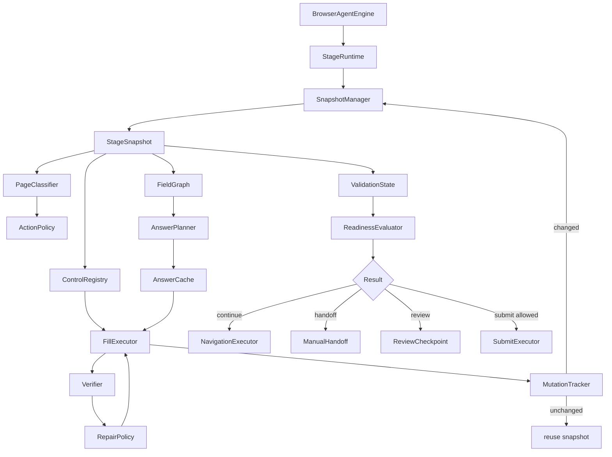
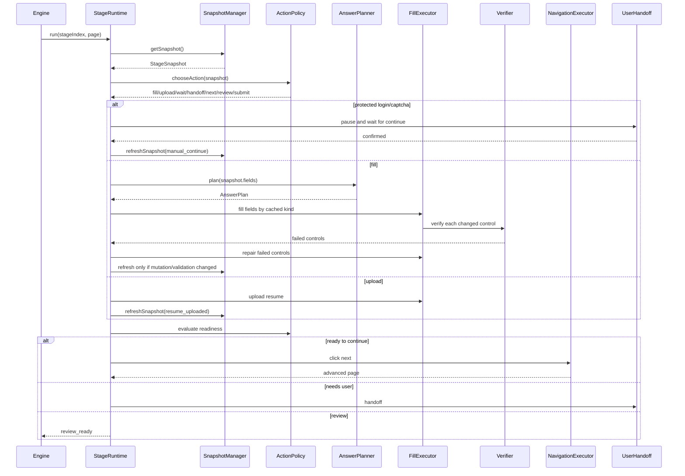

# Lean Browser Agent Architecture Proposal

This document proposes a cleaner architecture that keeps the current accuracy goals but reduces repeated DOM scans, repeated control classification, unnecessary LLM calls, and same-stage retry work.

The key idea is not to make the bot "less careful." The key idea is to make each expensive observation reusable until the page actually changes.

## Target Outcome

```text
Same accuracy:
  login handoff remains strict
  resume upload remains separate from text filling
  select/autocomplete/radio/checkbox strategies stay type-specific
  fill -> verify -> repair stays mandatory
  no final submit unless explicitly allowed

Less computation:
  one stage snapshot reused across observer/planner/filler/verifier
  control classification cached per DOM element
  answer plan cached by field graph signature
  LLM called only for unresolved/ambiguous fields
  mutation-driven re-observe instead of full scan after every small action
```

## Proposed Architecture Diagram



## Why The Current System Costs Extra Work

The current implementation is robust but repeats several expensive steps:

| Current pattern | Cost |
| --- | --- |
| `discoverVisibleFields()` then `observeBrowserPage()` then `discoverRuntimeVisibleFields()` | Multiple DOM/frame/shadow-root scans for the same stage. |
| `fillFormField()` runs live DOM strategy detection for each field | Correct but repeated when the same field is retried. |
| Required/validation scans run after many operations | Safe but can repeat unchanged reads. |
| Answer planning can run again when field graph changes slightly | Good for dynamic pages, but needs finer-grained cache invalidation. |
| Reflection LLM gets full context | Useful, but should only receive unresolved blockers and failed fields. |

The optimized version keeps the safety checks, but turns them into a shared state model.

## Better Module Layout

```text
browser-agent/
  engine.ts
    Still owns Chrome, login handoff, stage loop, and final receipt.

  runtime/
    stage-runtime.ts
      Owns one stage execution cycle and shared caches.

    snapshot-manager.ts
      Produces/reuses StageSnapshot. Invalidates only when URL, DOM mutation, progress text, or field graph changes.

    mutation-tracker.ts
      Tracks whether the page changed after fill/upload/navigation.

  observe/
    field-graph.ts
      Builds one normalized graph of visible controls, labels, options, groups, validation, and navigation controls.

    control-registry.ts
      Assigns stable ids and caches canonical control kinds.

    page-classifier.ts
      Classifies page state from the StageSnapshot.

  plan/
    action-policy.ts
      Ranks ask_user/wait/explore/upload/fill/next/review/submit.

    recovery-policy.ts
      Chooses repair/wait/handoff based on validation and failed field state.

  answer/
    answer-planner.ts
      Deterministic answer planning.

    llm-answer-planner.ts
      Only receives unresolved/ambiguous fields.

    answer-cache.ts
      Caches answers by stage signature + field signature + profile revision.

  fill/
    fill-executor.ts
      Routes each field by cached canonical control kind.

    strategies/
      text.ts
      select.ts
      autocomplete.ts
      choice.ts
      file-upload.ts
      date.ts
      country.ts

  verify/
    verifier.ts
      Verifies committed value from the same ControlRegistry.

    completion-guard.ts
      Blocks navigation if required fields remain empty.

  handoff/
    login-handoff.ts
    manual-handoff.ts

  trace/
    planner.ts
    debug-log.ts
```

## Proposed Stage Runtime

The current `BrowserAgentEngine.apply()` is doing almost everything. Keep it as the outer orchestrator, but move per-stage work into a `StageRuntime`.

```ts
type StageRuntimeInput = {
  context: BrowserContext;
  page: Page;
  job: Job;
  student?: StudentProfile;
  memory?: StudentMemory;
  resume?: ResumeRecord;
  baseFields: FilledField[];
  workspacePath: string;
  stageIndex: number;
  submit: boolean;
};

type StageRuntimeResult =
  | { kind: "advanced"; page: Page }
  | { kind: "review_ready"; page: Page }
  | { kind: "submitted"; page: Page }
  | { kind: "handoff_required"; page: Page; reason: string }
  | { kind: "needs_manual_review"; page: Page; reason: string }
  | { kind: "stopped"; page?: Page; reason: string };
```

New flow:

```text
BrowserAgentEngine.apply()
  -> launch/open/login guard
  -> for each stage:
       StageRuntime.run()
  -> persist receipt
```

This reduces the size of `engine.ts` and makes the expensive state reusable inside one stage.

## StageSnapshot: One Read, Many Consumers

Instead of every layer scanning the DOM independently, create one `StageSnapshot`.

```ts
type StageSnapshot = {
  url: string;
  title: string;
  fingerprint: string;
  stageSignature: BrowserStageSignature;
  pageText: string;
  fields: FieldNode[];
  controls: ControlNode[];
  validationMessages: string[];
  requiredEmptyLabels: string[];
  navigationCandidates: NavigationCandidate[];
  protectedCheckpoint: ProtectedCheckpointDetection;
  fileUpload: FileUploadState;
  finalSubmitVisible: boolean;
  capturedAt: string;
};
```

Consumers:

| Consumer | Uses |
| --- | --- |
| Page classifier | `pageText`, `fields`, `validationMessages`, `protectedCheckpoint` |
| Action policy | `classification`, `fileUpload`, `navigationCandidates`, `finalSubmitVisible` |
| Answer planner | `fields` |
| Fill executor | `fields`, `ControlRegistry` |
| Verifier | `ControlRegistry`, `validationMessages`, committed values |
| Completion guard | `requiredEmptyLabels`, failed attempts |

This replaces repeated independent calls to:

```text
discoverVisibleFields()
observeBrowserPage()
getVisibleRequiredEmptyLabels()
getVisibleValidationMessages()
hasFileUpload()
hasFinalSubmitControl()
getStageSignature()
getPageFingerprint()
```

with:

```text
snapshotManager.getSnapshot()
```

## Snapshot Invalidation

Do not refresh the whole page snapshot after every field. Refresh only when evidence says it changed.

```ts
type SnapshotInvalidationReason =
  | "url_changed"
  | "navigation_clicked"
  | "resume_uploaded"
  | "dom_mutated"
  | "validation_changed"
  | "field_graph_changed"
  | "manual_continue"
  | "timeout_poll";
```

Rules:

| Event | Snapshot action |
| --- | --- |
| Text field filled and DOM did not mutate | Reuse snapshot; verify just that control. |
| Select/autocomplete changed and list closed | Refresh validation/field subset only. |
| Resume uploaded | Full refresh after upload completion wait. |
| Continue clicked | Full refresh after transition. |
| User login/manual handoff completed | Full refresh. |
| MutationObserver detects new fields | Full refresh. |
| Same fingerprint/signature | Reuse cached answer plan and control kinds. |

## ControlRegistry: Detect Field Type Once

Current `fill.ts` correctly detects actual DOM type, but it can repeat this per field and retry. A `ControlRegistry` would cache the classification.

```ts
type CanonicalControlKind =
  | "text"
  | "textarea"
  | "date"
  | "number"
  | "email"
  | "phone"
  | "native_select"
  | "custom_select"
  | "autocomplete"
  | "radio_group"
  | "checkbox_group"
  | "file"
  | "contenteditable"
  | "unknown";

type ControlNode = {
  id: string;
  selector: string;
  frameId: string;
  label: string;
  context: string;
  kind: CanonicalControlKind;
  confidence: number;
  options: string[];
  required: boolean;
  currentValue: string;
  validationText?: string;
};
```

Benefits:

| Current | Proposed |
| --- | --- |
| Each fill may rediscover candidate controls. | Stage snapshot discovers controls once. |
| Strategy detection can run per retry. | Control kind cached until DOM changes. |
| Verifier re-finds controls by descriptor. | Verifier uses same control id/selector from registry. |
| Autocomplete vs text can be decided late repeatedly. | Autocomplete is classified once and routed consistently. |

## AnswerCache: Avoid Replanning Known Answers

Answer planning should be cached by the actual field graph and profile data.

```ts
type AnswerCacheKey = {
  jobId: string;
  studentId: string;
  profileRevision: string;
  resumeRevision?: string;
  fieldGraphSignature: string;
};
```

Cache invalidation:

| Change | Rebuild answer plan? |
| --- | --- |
| Same fields, same options, same profile | No |
| New required field appears | Yes, but only for new/unanswered fields |
| Field id changes but label/options same | No, remap cached answer to new control |
| Profile/resume/memory changes | Yes |
| Validation says value format rejected | Replan only failed field |

LLM optimization:

```text
Before:
  send all visible fields to LLM when enabled

After:
  deterministic planner answers known profile/resume fields
  unresolved fields are filtered
  low-risk writing fields go to LLM
  high-trust personal fields never go to LLM as guesses
```

This preserves safety while reducing LLM tokens and latency.

## Fill Strategy Router

Keep the current strategy separation, but make it plugin-like.

```ts
interface FillStrategyPlugin {
  kind: CanonicalControlKind;
  canFill(field: FieldNode, answer: Answer): boolean;
  fill(input: FillInput): Promise<FillResult>;
  verify(input: VerifyInput): Promise<VerifyResult>;
  repair?(input: RepairInput): Promise<RepairResult>;
}
```

Strategy table:

| Kind | Plugin | Behavior |
| --- | --- | --- |
| `native_select` | `select.ts` | Select by exact option, then fuzzy only inside options. |
| `custom_select` | `select.ts` | Open popup, score visible options, click committed option. |
| `autocomplete` | `autocomplete.ts` | Type query, wait suggestions, click best match, verify token/value. |
| `radio_group` | `choice.ts` | Score group options and click one label/wrapper. |
| `checkbox_group` | `choice.ts` | Toggle only intended options. |
| `file` | `file-upload.ts` | Resume upload only; never generic text fill. |
| `date` | `date.ts` | Format-aware commit. |
| `text/email/phone/number/textarea` | `text.ts` | Clear, fill, dispatch events, verify. |
| `country/location` | `country.ts` | Strict country/entity scoring to avoid India/Indonesia style errors. |

## Proposed Runtime Flow



## Reduced Computation Plan

| Optimization | Current cost reduced | Accuracy impact |
| --- | --- | --- |
| Shared `StageSnapshot` | Reduces repeated DOM reads. | Neutral or better because all modules share the same evidence. |
| `ControlRegistry` | Avoids repeated field type detection. | Better consistency; less accidental text fallback. |
| Mutation-driven re-observe | Avoids full scans after no-op fills. | Neutral if full refresh still happens after upload/navigation/manual handoff. |
| Per-field verification | Avoids full page validation after every single text field. | Safe if page-level guard still runs before Continue. |
| Answer cache | Avoids repeated deterministic/LLM planning on unchanged fields. | Neutral if invalidated by field graph/profile changes. |
| LLM only for unresolved fields | Reduces token usage/latency. | Same or safer for personal facts. |
| Strategy plugins | Avoids giant fallback chains and makes routing deterministic. | Better because a classified autocomplete cannot accidentally become plain text too early. |
| Debug sampling | Reduces IO for repeated identical snapshots. | Keep full logs for failures; sample clean repeated states. |

## Accuracy Preserving Guards

These must remain mandatory:

| Guard | Why it must stay |
| --- | --- |
| Protected checkpoint detection before every stage | Login/CAPTCHA can appear mid-flow. |
| Manual login confirmation button | Prevents bot from acting while user is logging in. |
| File upload separated from generic field fill | Prevents file picker loops and wrong file inputs. |
| Field-type strategy routing | Prevents typing into selects/radios/autocomplete as if they were text. |
| Verify after fill | Detects fields that look filled but are not accepted. |
| Page-level completion guard before Continue | Prevents leaving incomplete pages. |
| Same-screen/back-loop guard | Prevents endless back/forward loops. |
| Submit gate | Prevents accidental external submission. |

## Concrete Migration Plan

### Phase 1: Introduce StageSnapshot Without Changing Behavior

Add:

```text
browser-agent/runtime/snapshot-manager.ts
browser-agent/observe/field-graph.ts
browser-agent/observe/control-registry.ts
```

Initially, these can wrap existing functions:

```text
discoverVisibleFields()
observeBrowserPage()
getVisibleRequiredEmptyLabels()
getVisibleValidationMessages()
hasFileUpload()
hasFinalSubmitControl()
getStageSignature()
getPageFingerprint()
```

Goal:

```text
No behavior change.
Only centralize what is already being read.
```

### Phase 2: Cache Control Classification

Move detection results from `fill.ts` into `ControlRegistry`.

Before:

```text
fillFormField()
  -> resolveFillStrategy()
  -> detectRuntimeFillStrategy()
  -> fillByClassifiedControl()
```

After:

```text
fillFormField()
  -> ControlRegistry.get(field.controlId).kind
  -> strategyPlugin[kind].fill()
```

Fallback:

If the cached selector is stale, refresh only that field or refresh the snapshot.

### Phase 3: Make Answer Planning Incremental

Before:

```text
runAutonomousStageFill()
  -> buildStageAnswerPlan(all visible fields)
```

After:

```text
answerCache.getOrBuild(fieldGraphSignature)
  -> deterministic answers for all fields
  -> LLM only for unresolved fields
  -> repair LLM only for failed fields
```

### Phase 4: Split Fill Strategies

Move strategy-specific code out of the large `fill.ts` file into smaller modules:

```text
fill/strategies/text.ts
fill/strategies/select.ts
fill/strategies/autocomplete.ts
fill/strategies/choice.ts
fill/strategies/country.ts
fill/strategies/file-upload.ts
fill/strategies/date.ts
```

This does not have to change logic. It makes failures easier to debug and prevents strategy fallbacks from becoming tangled.

### Phase 5: Event-Driven Reobserve

Add a browser-side MutationObserver during a stage:

```ts
type MutationSummary = {
  addedControls: number;
  removedControls: number;
  validationTextChanged: boolean;
  urlChanged: boolean;
  popupOpened: boolean;
  popupClosed: boolean;
};
```

Use it like:

```text
fill one field
  -> verify that field
  -> if mutation summary says no graph/validation change:
       reuse snapshot
     else:
       refresh snapshot
```

Still run a full page-level guard before Continue.

## Expected Runtime Improvements

These are practical expectations, not guaranteed benchmarks:

| Area | Expected improvement |
| --- | --- |
| DOM scanning | Fewer full scans per stage because one snapshot feeds all modules. |
| Field filling | Fewer repeated candidate searches because control ids/kinds are cached. |
| LLM usage | Fewer calls and smaller prompts because only unresolved/failed fields are sent. |
| Retry loops | Less repeated work because retries target failed controls only. |
| Debugging | Easier to locate failures because each strategy is isolated. |

## Recommended Target Algorithm

```text
Open or resume controlled Chrome
  -> Detect protected checkpoint
  -> If login/CAPTCHA: full manual handoff
  -> Create StageRuntime
  -> Get or refresh StageSnapshot
  -> Classify page and choose action
  -> If upload: upload resume, wait, refresh snapshot
  -> If fill:
       build cached answer plan
       for each answer:
         get cached control kind
         fill with matching strategy
         verify that control
       repair failed known controls
       run page-level completion guard
  -> If blockers remain: repair or handoff
  -> If complete: click next or pause at review/submit
```

## What Not To Change

Do not weaken these current behaviors:

| Keep | Reason |
| --- | --- |
| `waitForLoginConfirmation()` style manual login pause | It is the safest legal/product path for third-party portals. |
| `attachResume()` as a separate file upload path | Generic field filling should not own file chooser behavior. |
| Strict country matching | Prevents India/Indonesia and select-all-country bugs. |
| `evaluateStageReadiness()` before navigation | Prevents moving away from incomplete stages. |
| Planner/debug logs | Essential for debugging unpredictable ATS pages. |

## Best First Refactor

The highest ROI first step is:

```text
StageSnapshot + ControlRegistry
```

Why:

1. It reduces repeated DOM work immediately.
2. It makes type detection consistent across fill and verify.
3. It does not require changing login handoff, resume upload, or answer logic.
4. It creates the foundation for smaller strategy modules later.

